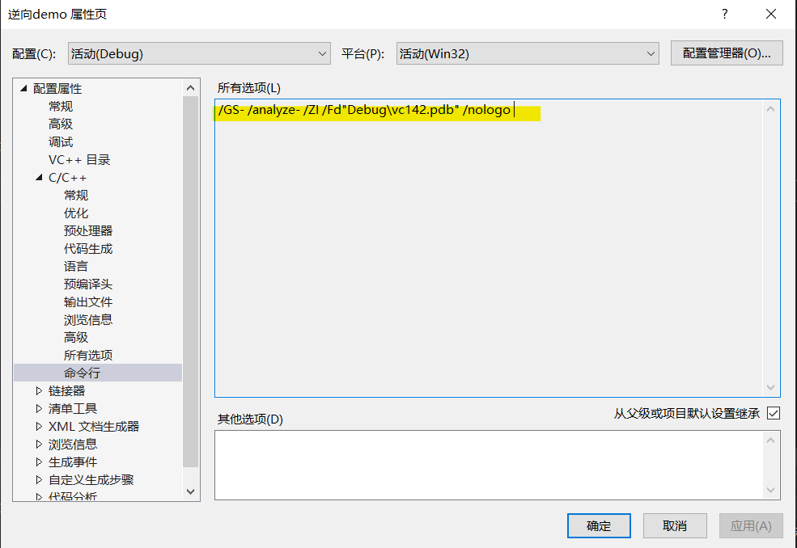
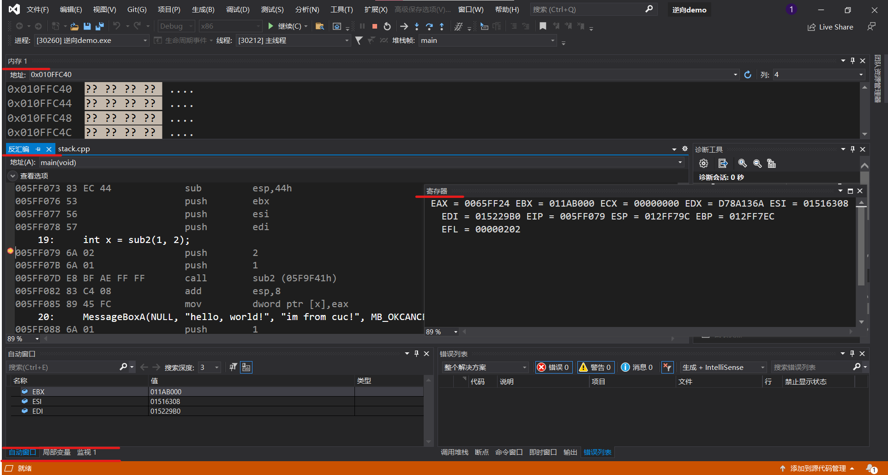
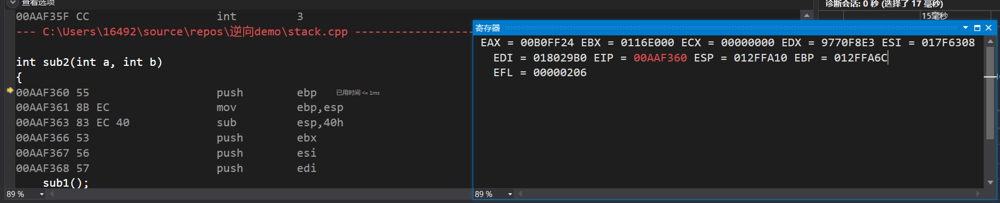

# Reverse-Engneering

### 1、在vs中建立工程，修改编译选项，只保留 /ZI （调试）和pdb文件路径两个选项，增加禁用安全检查选项（/GS-)。



### 2、编译多个函数调用的示例代码。

右键项目，选择生成就行。

### 3、下断点调试运行，观察反汇编、寄存器、内存等几个调试时的信息。

- 断点设置在main函数中第一句语句之前。



### 4、分析函数调用过程中栈的变化。解释什么是栈帧？ebp寄存器在函数调用过程中的变化过程，ebp寄存器的作用。

- eip 保存的是将要执行的下条指令的地址

- esp 栈顶指针 保存栈顶地址

- ebp 栈底指针 保存栈底地址

#### 栈帧：

每一次函数的调用,都会在调用栈上维护一个独立的栈帧。每个独立的栈帧一般包括:

- 函数的返回地址和参数
- 临时变量: 包括函数的非静态局部变量以及编译器自动生成的其他临时变量
- 函数调用的上下文

#### ebp寄存器的变化：

- 在执行第一句语句```int x = sub2(1, 2);```之前，ebp指向**012FFAB4**；

- 执行``` push        ebp  ```

- 执行```mov         ebp,esp``` ，此时ebp指向**012FFA6C**，即表示调用者main函数此时的栈顶成为被调用函数sub2的栈底，由此开始一个新的栈帧；

- 给新栈帧分配空间 `sub esp`

- 接下来几句指令ebp并不变化；进入main函数第一句的语句```int x = sub2(1, 2);``` ,首先push两个参数入栈（新的栈帧）;

  ```
  00AAF079 6A 02                push        2  
  00AAF07B 6A 01                push        1  
  ```

- 接下来就是使用call命令跳转到被调用函数sub2，在跳转前，将当前函数（main）的下一条命令的地址入栈；

- 进入sub2函数中，准备调用sub1函数；

  

- ``` push        ebp  ``` 保存调用函数sub2的栈底；

- ``` mov         ebp,esp ``` sub2的栈顶成为sub1的栈底；

- ``` sub         esp,40h ``` ，ebp指向**012FFA0C**；

- 进入sub1后同理。

#### ebp寄存器的作用：

- 指向当前的栈帧的底部；
- 调用新的函数时，把调用者函数的栈底（即ebp的地址）保存在新的栈帧中（```push ebp```）；
- 把被调用函数的栈底地址存入ebp中；
- 被调用函数返回值时，再将栈帧中保存的调用者的栈底弹出到ebp中，从而返回到调用函数。

### 5、函数局部变量和参数的保存位置、访问方式是什么。

```
00AAF079 6A 02                push        2  
00AAF07B 6A 01                push        1  
```

```
	return a + b;
00AAF36E 8B 45 08             mov         eax,dword ptr [a]  
00AAF371 03 45 0C             add         eax,dword ptr [b]  
```

由上面汇编代码和上方分析可知，局部变量和参数按从右到左的方式(先2后1)首先存入被调用函数的新栈帧中，函数返回时是将返回值保存在eax寄存器中的。而ptr[a]则表示访问方式是通过指针找到参数地址的。若a,b未赋值，则根据a和b的类型，即int(4bytes)，寻找ebp-4 和ebp-8，即为这两个局部参数。

### 6、多层的函数调用，栈的变化情况，解释未赋初始值的局部变量的值是如何形成的。

栈的变化即上文所述调用函数时通过将调用者的栈顶变为被调用者的栈底、存储调用者的栈帧的栈底，开辟新的栈帧，存入局部变量等等，继续在内部开辟新栈帧执行被调用的新函数，知道最内部的函数返回值，跳转到它的调用者，就回收这一被调用函数的局部参数，转而继续执行调用它的外部函数。

若局部参数c未赋值，则根据c的类型，即int(4bytes)，寻找ebp-4 ，即为这个局部参数。而这个内存中的原始值就成为了c的值。
